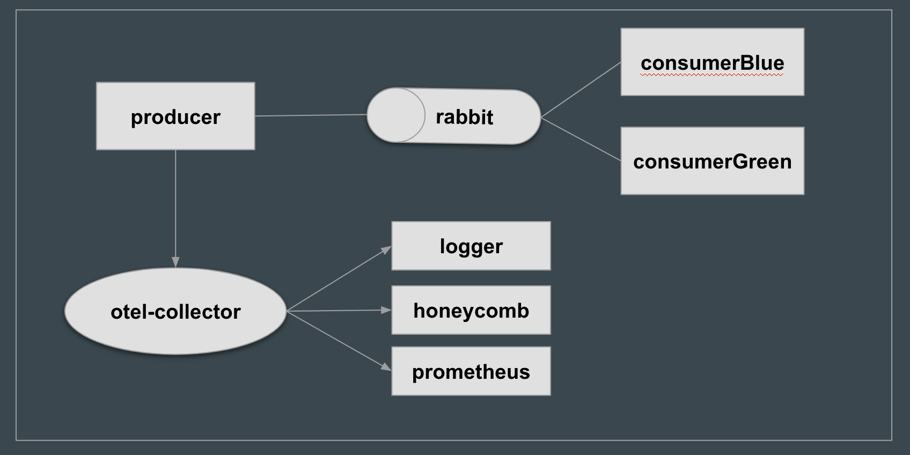

# Otel Demo
A quick demo on using OpenTelemetry for Tracing and Metrics for your application.

# Components
- Otel collector to collect data
- prometheus to export metrics to
- RabbitMQ for our message queuing
- Three simple golang programs acting as producer and consumers to Rabbitmq sending

  

  Sending messages: 
  - curl -si -X POST -d "message here" http://localhost:3333/blue
  - curl -si -X POST -d "message here" http://localhost:3333/green

## RabbitMQ
Messaging queue running at: http://localhost:15672

## Otel

### zpages
 An extention helpful in debugging and troubleshooting.

    http://localhost:55679/debug/tracez
    http://localhost:55679/debug/rpcz
    http://localhost:55679/debug/servicez
    http://localhost:55679/debug/pipelinez
    http://localhost:55679/debug/extensionz

### Heathcheck
Check Otel health 

    http://localhost:13133

## Prometheus
Prometheus running on 9090 and scraping metrics from Otel.
http://localhost:9090

## Useful Resources

- Otel Sample: https://github.com/open-telemetry/opentelemetry-go/blob/master/example/otel-collector/main.go
- Intro + Demo by Ted Young (Lightstep): https://youtu.be/yQpyIrdxmQc
- Github: https://github.com/open-telemetry
- Microsoft-Engineering-Playbook: https://github.com/microsoft/code-with-engineering-playbook
- Gremlin Blog: https://www.gremlin.com/blog/knowing-your-systems-and-how-they-can-fail-twilio-and-aws-talk-at-chaos-conf-2020/

